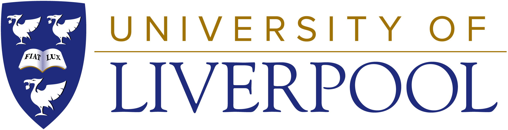

Quantum Navigation Toolbox
==========================

About
-----
A Python based navigation toolbox designed to be used for experimenting
with multi-source navigation. This library provides the necessary services
to conduct in-depth realistic simulations, fully configurable by the user.
These can extend from employing simple numerical methods to track movement
along a basic pre-generated racetrack, to using kalman filters with
tightly-coupled GPS fusion to track a custom vehicle along a bespoke
trajectory. The implementation and object association is easy to
understand an supports third-party additions. In summary, the toolbox
presents the following key features:

* Trajectory generation with vehicle constraints
* Configurable accelerometers, gyroscopes and altimeters
* External clock allowing for controlled timing errors
* Selection of Inertial Navigation (INS) Fusion Methods
* GPS satellite simulation with pseudo range generation
* GPS fusion (fixed gain, loosely-coupled, tightly-coupled)
* Inertial based quantum sensors and fusion methods
* Gravity gradient based quantum sensors and fusion methods
* Generating and plotting interactive results in web browser
* Handling of various input and output file types for data
* Support for platforms with limited hardware resources

.. toctree::
   :maxdepth: 2
   :caption: Contents:
   :numbered:

   usage/structure
   usage/execution
   usage/technical
   usage/trajectory
   usage/gravity_modelling
   usage/measurement
   usage/fusion
   usage/configuration
   usage/packages
   usage/requirements
   usage/tutorials
   usage/faq
   usage/future
   usage/legal

Indices and tables
------------------

* :ref:`genindex`
* :ref:`modindex`
* :ref:`search`
