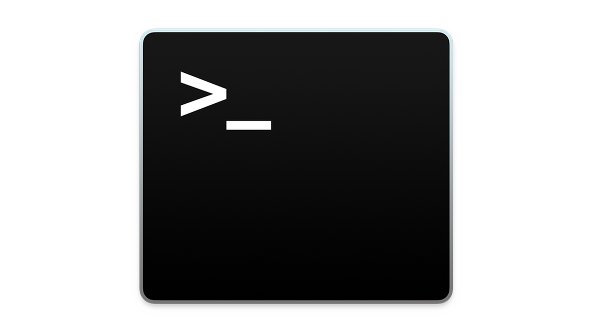
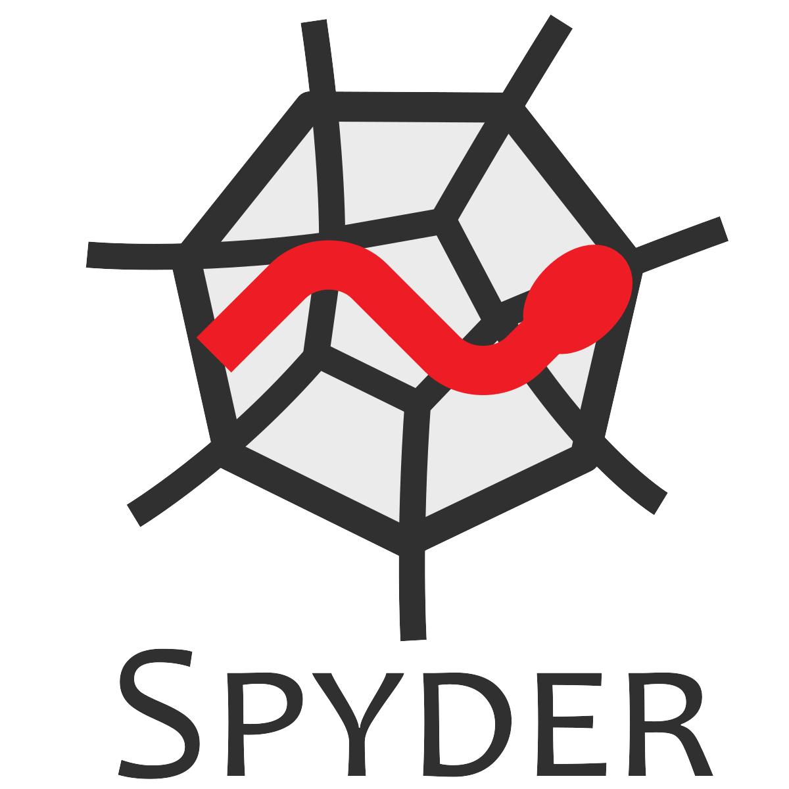

Software Usage
==============

The navigation software can be used in many ways. Firstly, and most commonly, it can simply be executed via command
line with a selected configuration file. The toolbox can also be executed through Integrated Development Environments
(IDEs) such as PyCharm, Spyder or IDLE. These are particularly useful for viewing the output values in detail and/or
performing additional processing steps such as calculating or plotting statistics. Lastly, the toolbox can be
integrated and employed by other Python projects. The most common ways to use the software are discussed
in this section.

.. important:: During development it was noted that the interface and layouts for the various IDEs used evolved with
    time. There is also small variations between platforms such as Microsoft Windows and MacOS. The names and
    locations of the buttons, menus and settings discussed in this section could have changed slightly.

|

Command Line Usage
------------------

For standalone usage, the software simulation can be simply executed from the command line when within the project's
root directory. This usage has the advantage of not requiring the software to be installed or invoked via
Python programming. To run a simulation directly, *employing the default configuration settings*, the following single
command can be used. This launch command is identical for Windows, Linux and MacOS systems.

.. code-block:: python
    :caption: Execute PNT Toolbox with default settings

    python3 run.py

If multiple versions of Python are installed on the host machine it is always best to explicitly state which version
is to be used to avoid any compatibility issues. To use Python 3.12 replace '**python3**' with '**python3.12**'.

On execution, the software will extract its settings and user preferences from a provided configuration file.
Configuration files are used to describe all input parameters including the simulated environment, hardware/sensor
activity and vehicle limitations/restrictions. A requested configuration can be state by supplying its name (and
location) as the first argument to the run script. If a configuration file is not provided, the default
configuration ``default_settings.ini`` will be used automatically.

An example of using a custom created configuration file named ``custom_config.ini`` (that is located in the project's
root directory) has been generated below.

.. code-block:: python
    :caption: Execute PNT  Toolbox with custom settings

    python3 run.py custom_settings.ini

The expected structure and format of configuration files is discussed in detail under
:ref:`User Configuration` (discussed next).

|

Anaconda/Spyder Usage
---------------------

To run the software through `Anaconda/Spyder <https://www.anaconda.com/products/individual>`_ simply open Spyder and
select "**New Project...**" under the "**Project**" dropdown menu at the top of the page. From there, create a new
project with an appropriate name such as 'Nav Toolbox'. After this step, copy or move the entire contents of the
toolbox's root directory to the location of the created Spyder project. Once complete, the files should appear on
the left hand-side in Spyder. To launch the software **right-click** the script ``run.py`` and select "**run**".
The software should now be running with the default settings.

.. note:: It is best to create a new project rather than attempting to open the toolbox as an existing one, since
    creating a new project results in Spyder producing new hidden auxiliary and settings files (based on your
    environment rather than trusting the included ones).

If you wish to select a different configuration file to use rather than the default settings, this can be done so by
providing the location of a configuration file as the first command line argument. To do this in Spyder simply
select "**Configuration per file...**" from the "**Run**" dropdown menu at the top. Ensure the execution file
``run.py`` is selected under the dropdown box titled "**Select a run configuration:**". Then under
"**General settings**" enable "**Command line options:**" and enter the name/location of the configuration file to use.
To launch the toolbox with these settings click the "**run**" button located at the bottom of the menu.

For an example, lets assume we wish to use a configuration file called ``custom_settings.ini`` which is located in the
same directory as ``default_settings.ini``. To do this, we would enter **custom_settings.ini** into the
"**Command line options:**" box. The toolbox will then automatically find the configuration file to use.

|

PyCharm Usage
-------------

To use the software with `JetBrain's PyCharm <https://www.jetbrains.com/pycharm/download/>`_ simply create a new
project. If not prompted at the home screen, this can be achieved by selected "**New Project...**" from the
"**File**" dropdown menu at the top of the screen. From there ensure the project is being created in a sensible
location and given an appropriate name. During the new project's creation you will be asked to select the
"**Python Interpreter**" to use. It is recommended to select "**New Environment Using:**" one of the followings:

#. **Virtualenv** - Isolated virtual environment (highly recommended).
#. **Pipenv** - Creates and manages a virtualenv with Pipfiles.
#. **Conda** - Anaconda Python distribution (requires Conda to be installed).

.. note::
    More information of configuring a Python interpreter in PyCharm is available
    `here <https://www.jetbrains.com/help/pycharm/configuring-python-interpreter.html>`_!

With the project created copy the Quantum Navigation files to the its location. Once complete, the files should
appear within the left hand-side panel. To launch the software **right-click** the script ``run.py``
inside the root folder and select "**Run 'run_simulation'**". The software should now be running with
the default settings.

If you wish to select a different configuration file to use rather than the default settings, this can be done so by
providing the location of a configuration file as the first command line argument. To do this in PyCharm simply
**right-click** the script and select the **More Run/Debug** menu, then select "**Modify Configurations...**".
From this menu enter the name/location of the configuration file to use in the box named "**Script Parameters**" and
then click "**Apply**". Each time the ``run.py`` is executed these settings will now be used.

Note these settings may reset or change between sessions or when executing other scripts.

|

Eclipse/PyDev Usage
-------------------

The project can also be used in `PyDev <https://www.pydev.org/>`_ (an `Eclipse <https://www.eclipse.org/ide/>`_
plug-in for Python development). To use the Quantum Navigation Toolbox in PyDev, simply create a new project. This can
be done by going to the "**File**" Dropdown menu and selecting "**New**", "**Project**", "**PyDev**", then
"**PyDev project**".
From the PyDev Project creation window ensure the new project is given a suitable name and location. Ensure
"**Python**" is selected as the "**Project type**" and that a compatible version of Python is chosen
(i.e. Python 3.8 or above).

.. note::
    More information of creating and importing Python projects in PyDev is available
    `here <https://www.pydev.org/manual_101_project_conf.html>`_!

With the project created copy the toolbox files to the its location. Once complete, the files should
appear within the left hand-side panel. To launch the software within PyDev **open the script** ``run.py``
inside the root folder. With the script ``run.py`` being displayed in the editor, go to the "**Run**" dropdown menu
and select "**Run As**" followed by "**Python Run**". Alternatively the shortcut key **F9** can be used to run the
script currently open. The software should now be running with the default settings.

If you wish to select a different configuration file to use rather than the default settings, this can be done so by
providing the location of a configuration file as the first command line argument. To do this in PyDev firstly open the
main run file ``run.py`` so it is being displayed in the editor. Then go to the "**Run**" dropdown menu and select
"**Run Configurations...**" located under the "Run As". From there ensure the current script is selected
on the **left-hand side** under "**Python Run**". Finally, under the "**Arguments**" tab enter the name/location of the
configuration file to use in the box titled "**Program arguments:**" then click "**apply**" followed by "**Run**".
If needed, alternative steps for setting runtime arguments are available
`here <https://www.dev2qa.com/how-to-pass-command-line-parameters-to-python-script-in-eclipse-pydev/>`_!
