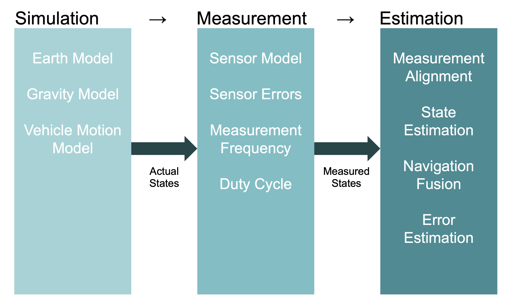

Technical Overview
==================
This section discusses the technical aspects of the project; detailing the internal dataflow. This is namely used to
describe the key stages during typical execution of the software. Moreover, this section also outlines how the project
correctly enforces separations between the simulated "real" world, extracted measurements and the estimated states.

|

Trajectory Generation
---------------------
Firstly, during a typical run-cycle, the software will firstly calculate the ground truth trajectory. This is performed
using a two-step approach. During the first step a trajectory path is constructed to reach the given base points while
complying with the selected vehicle model. This is generated at a frequency subject to the vehicles speed. During the
next step the trajectory properties are calculated at each step (being the position, velocity, acceleration,
attitude and angle rate records). These produced values can then serve as a look-up table with interpolation,
using the simulation time in seconds as the key.

Estimation Initialisation
--------------------------
Secondly, with the ground truth trajectory generated, the initial estimation states can be declared. In the simplest
usage these can be read directly from the first record of the ground truth trajectory (at 0 seconds). But
realistically, initial estimation errors will be applied on top of these. Other differences, such as expected
state errors and a non-identical gravity model (purposely unlike the one used to generate the ground truth)
can be set here.

Sensor Configuration
--------------------
Thirdly, using the initial estimated states, the sensors and their corresponding fusion methods can now be
configured and paired. Individual sensors, such as the accelerometer and gyroscopes, can be configured with custom
error profiles, axis orientations and random number generation (used for generating pseudo-random noise and errors).
These will then assigned to one or more fusion methods. For instance, the accelerometer and gyroscopes could be
be allocated to a configured Kalman Filter for INS fusion. In addition, the same sensors could be shared and also
assigned to other fusion methods, such as quantum sensors.

Simulation Loop
---------------
With everything configured, the main simulation loop can now be executed with all over the above. At a minimum, a
simulation loop requires a ground truth trajectory, initial estimated state and a series of sensor-fusion pairs.
Optionally, a custom clock model can be included to invoke purposeful timing errors. Custom display and result
collectors can also be passed to obtain information with configured levels of filtering.

During the first step of the simulation, a scheduler is initialised for handling the sensors and fusion, calling the
next due senor or fusion method on time. When a sensor is ready for a measurement, the simulation time is move up to
that time, with clock errors applied. The sensor is then given the ground truth record for that time, which is then
uses to produce a noisy measurement (which is held/cached internally). When a fusion method is ready, depending on
its trigger mode, it collects the noisy measurements from its sensors and processes then before updating the
estimated state.

This approach allows sensors and fusion methods to be dynamically included in simulations, while enforcing complete
separation between ground truth (solely seen by sensors) and the estimated state (solely updated by fusion methods
with noisy measurements).

Capturing Results
-----------------
After the simulation loop is complete, the captured results (either from the default or given results collector)
will be returned. Results are firstly written to disk using the projects own binary file format (optimised for
sequentially reading and writing of records). After this, results will then be exported in any of the requested file
formats (such as csv, binary, numpy, MATLAB save) with various levels of compression (both lossly and lossless).
Separate files are made for both the ground truth (optional) and estimation state records.

Displaying Results
------------------
If enabled, after results have been written to disk, their data will be displayed in a series of interactive
graphs and plots comparing the ground truth and estimation history against time. The supported figure types are
as listed:

* Summary Table Plot
* 2D Open Street Map Plot
* 2D Lat-Lon Plot
* 3D Lat-Lon-Alt Plot
* Position Axes Plot
* Velocity Axes Plot
* Acceleration Axes Plot
* Attitude Axes Plot
* Angle Rate Axes Plot

Recreation
----------
After the simulation, the same results can be recreated by setting the same parameters and random seeds. To aid with
this, a complete configuration file containing all parameters used is dumped into the generated results folder.
